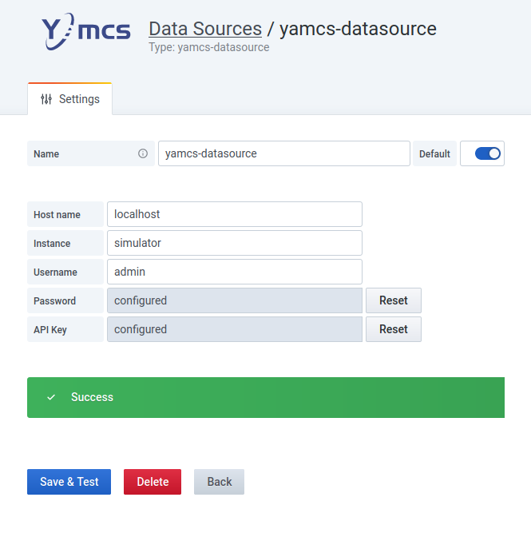

# Yamcs-Grafana

This repository contains a Grafana plugin allowing the use of Yamcs as a Datasource.

## Installation

### Yamcs
Yamcs source code and installation instructions can be found on GitHub [here](https://github.com/yamcs/yamcs).


### Grafana

Follow [these](https://grafana.com/docs/grafana/latest/getting-started/getting-started/) instructions to install and setup Grafana.

Then, edit the Grafana configuration file :
```/etc/grafana/grafana.ini ```

In the *paths* section, change the plugin directory to :
```ini
[paths]
# Directory where grafana will automatically scan and look for plugins
plugins = ~/yamcs-grafana/grafana-plugins
```


## Usage
Run the yamcs simulator in one terminal :
```bash
cd ~/yamcs
./run-example.sh simulation
```
Run these commands in an other terminal :
```bash
cd ~/yamcs-grafana/grafana-plugins/yamcs-datasource
yarn install
yarn dev
sudo systemctl restart grafana-server
```
On ```localhost:3000``` you should find the Grafana homepage.

Add a datasource : on ```localhost:3000/datasources ``` -> add a datasource -> search for *yamcs-datasource*.

You should now be able to select this datasource when editing a dashboard panel.

## Configuration

### Instructions

Enter the name of your Yamcs Server in the *Host name* field.

Enter the name of your Yamcs instance in the *Instance* field.

Enter your Yamcs username and password.

You can have multiple instances of this plugin with different configurations.

You can test your configuration using the ```Save & Test``` button.

### Example

For monitoring the Yamcs *simulation* example : ```./run-example simulation ``` <br></br>
with the Yamcs server running on the same host as Grafana.




## Contributing


## License
